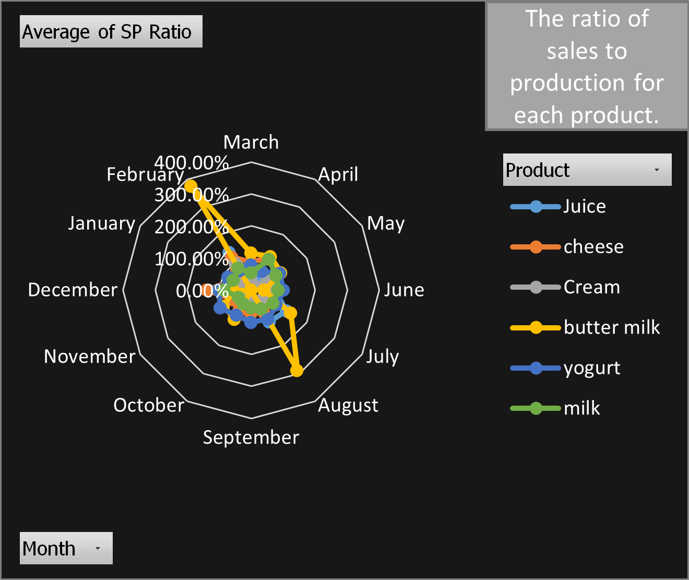
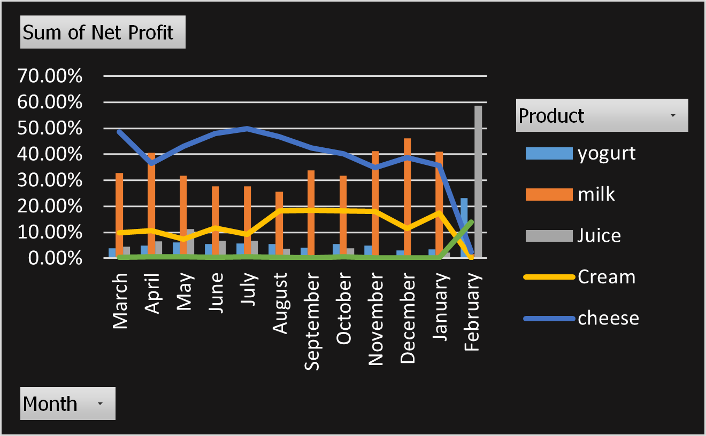

## KPI Dashboard Visualizations

This section presents the main operational and profitability metrics analyzed across Kalber Dairy products during a 12-month period.

---

### 1. Sales-to-Production (SP) Ratios by Product

*Shows the relationship between monthly sales and production levels across products.*

**Key Observation:**  
Most products remain within a relatively stable range throughout the year. However, buttermilk shows sharp spikes in August and February, indicating periods where sales significantly exceeded production levels.

---

### 2. Monthly Product Revenue Breakdown

*Illustrates the monthly sales contribution of each product category.*

**Key Observation:**  
Milk remains the dominant revenue source for most of the year. In February, juice sales increase sharply and account for the largest share of total revenue.

---

### 3. 12-Month Net Profit Margins by Product

*Tracks monthly profitability trends across product lines.*

**Key Observation:**  
Milk and cheese maintain relatively stable profit margins during most months, while juice profitability rises significantly in February.

---

### 4. Product Share of Net Profit

*Compares the distribution of net profit across products over time.*

**Key Observation:**  
Milk and cheese generate the majority of profits during most months, while juice becomes the leading profit contributor at the end of the fiscal cycle.
